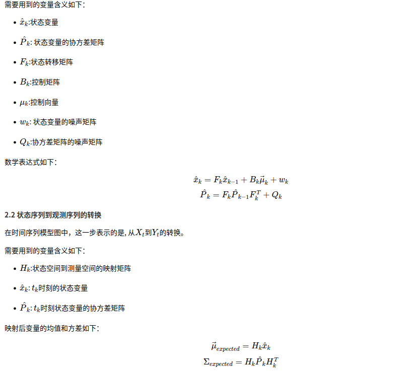

# 0 目标追踪方向两大主线
0 综述相关博文(放在这里可以不读，自己已总结) 
- https://www.cnblogs.com/silence-cho/p/14211183.html 
&emsp;&emsp; (1)  
&emsp;&emsp; (2)  
- [为什么喜欢用滤波而不用深度学习](https://blog.csdn.net/Wu234321/article/details/126659068)

基于时序（状态）和基于目标（特征）这两大类才是本质的分类
- 时序的如卡尔曼滤波、粒子滤波以及LSTM
- 基于目标的相关滤波、siamRPN网络等

1 基于滤波
- 卡尔曼滤波 
- 粒子滤波
- 相关滤波  
     

2 基于深度学习 
- SVM分类器 [学习总结](../06_machine/01_classification/05_SVM.md)

https://www.google.com/search?q=%E4%B8%BA%E4%BB%80%E4%B9%88%E6%BB%A4%E6%B3%A2%E5%8F%AF%E4%BB%A5%E5%81%9A%E8%BF%BD%E8%B8%AA&oq=%E4%B8%BA%E4%BB%80%E4%B9%88%E6%BB%A4%E6%B3%A2%E5%8F%AF%E4%BB%A5%E5%81%9A%E8%BF%BD%E8%B8%AA&gs_lcrp=EgZjaHJvbWUyBggAEEUYOTIHCAEQABiiBDIHCAIQABiiBNIBCTExNzQzajBqNKgCALACAA&sourceid=chrome&ie=UTF-8#ip=1

# 1 基于滤波的方案
## 1.1 基于卡尔曼滤波的目标追踪算法
1 博客网址
- [卡尔曼滤波与目标追踪](https://blog.csdn.net/yuxuan20062007/article/details/80864246)
- [目标追踪中的卡尔曼滤波](https://www.cnblogs.com/silence-cho/p/15112346.html)

